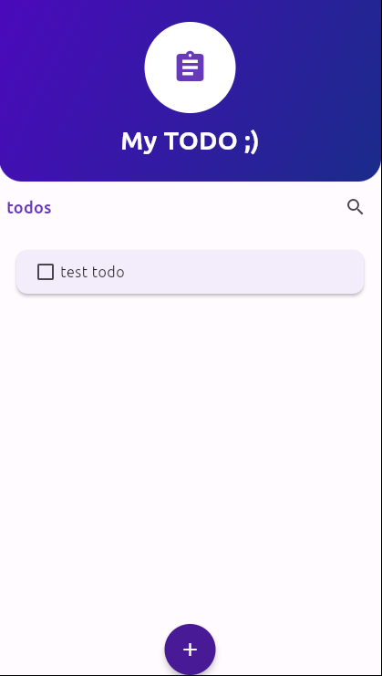
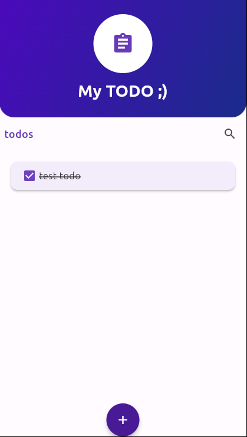
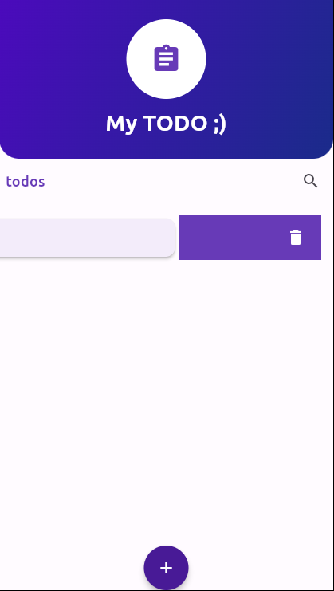

# Todo App

A simple Flutter TODO app that allows you to manage your tasks.

## Screenshots


*Caption: Screenshot of the app in its normal state.*


*Caption: Screenshot of a task after being checked.*


*Caption: Screenshot of a task being deleted.*

## Features

- Add new tasks to your TODO list.
- Mark tasks as completed with a checkbox.
- Remove tasks by swiping.

## Getting Started

To run this project, make sure you have Flutter installed. Then, clone the repository:

```bash
git clone https://github.com/your-username/todo-app.git
cd todo-app
``` 
Install the dependencies:

```bash 
flutter pub get
```
Run the app
```bash
flutter run
```
## Usage
Add a new task by tapping the '+' button.
Mark a task as completed by tapping the checkbox.
Delete a task by swiping left or right.

Contributions
Contributions are welcome! If you find a bug or want to add a new feature, please create an issue or submit a pull request.

